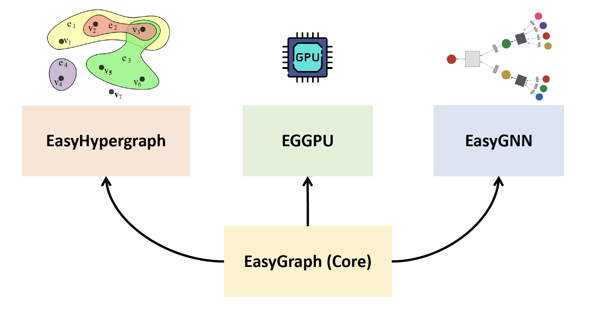

EasyGraph
==================

Copyright (C) <2020-2025> by [DataNET Group, Fudan University](https://fudan-datanet.mysxl.cn/)

___________________________________________________________________________

[![PyPI Version][pypi-image]][pypi-url]
[![Python][python-image]][python-url]
[![License][license-image]][license-url]
[![Downloads][downloads-image]][downloads-url]

[pypi-image]: https://img.shields.io/pypi/v/Python-EasyGraph.svg?label=PyPI
[pypi-url]: https://pypi.org/project/Python-EasyGraph/
[python-image]: https://img.shields.io/pypi/pyversions/Python-EasyGraph.svg?label=Python
[python-url]: https://pypi.org/project/Python-EasyGraph/
[license-image]: https://img.shields.io/pypi/l/Python-EasyGraph?label=License
[license-url]: https://github.com/easy-graph/Easy-Graph/blob/master/LICENSE
[downloads-image]: https://static.pepy.tech/personalized-badge/python-easygraph?period=total&units=international_system&left_color=brightgreen&right_color=yellowgreen&left_text=Downloads
[downloads-url]: https://pypi.org/project/Python-EasyGraph/

- **Documentation:** https://easy-graph.github.io/
- **Source Code:** https://github.com/easy-graph/Easy-Graph
- **Issue Tracker:** https://github.com/easy-graph/Easy-Graph/issues
- **PyPI Homepage:** https://pypi.org/project/Python-EasyGraph/
- **Youtube channel:** https://www.youtube.com/@python-easygraph

# Introduction
The framework of EasyGraph is composed of four components: **EasyGraph (Core)**, **EasyHypergraph**, **EGGPU**, and **EasyGNN**. 


**EasyGraph** is an open-source network analysis library primarily written in Python. It supports both undirected and directed networks and accommodates various network data formats. EasyGraph includes a comprehensive suite of network analysis algorithms such as community detection, structural hole spanner detection, network embedding, and motif detection. Additionally, it optimizes performance by implementing key components in C++ and utilizing multiprocessing.

<!-- # New Features in Version 1.3
- **Support for more hypergraph metrics and algorithms.** Such as [hypercoreness](https://www.nature.com/articles/s41467-023-41887-2), [vector-centrality](https://www.sciencedirect.com/science/article/pii/S0960077922006075), [s-centrality](https://epjds.epj.org/articles/epjdata/abs/2020/01/13688_2020_Article_231/13688_2020_Article_231.html), and so on.
- **Support for more hypergraph datasets.** Static hypergraph datasets and dynamic datasets can be both loaded by calling the corresponding dataset name.
- **Support for more flexible dynamic hypergraph visualization.** Users can define dynamic hypergraphs and visualize the structure of the hypergraph at each timestamp.
- **Support for more efficient hypergraph computation and hypergraph learning.** Adoption of suitable storage structure and caching strategy for different metrics/hypergraph neural networks.
-->
👉 For more details, please refer to our [documentation](https://easy-graph.github.io/) page.


---
**EasyHypergraph** is a comprehensive, computation-effective, and storage-saving hypergraph computation tool designed not only for in-depth hypergraph analysis but also for the growing field of hypergraph learning. 
It bridges the gap between EasyGraph and higher-order relationships. EasyHypergraph is developed as an integrated module within the EasyGraph framework, maintaining full compatibility with its core architecture.

👉 For more details, please refer to its [documentation](https://easy-graph.github.io/docs/hypergraph.html) page.

---
**EGGPU** is a high-performance GPU-accelerated network analysis library that supports essential functions such as betweenness centrality, k-core centrality, and single-source shortest path,as well as structural hole metrics like constraint. Built on top of the EasyGraph library, EGGPU features an efficient system architecture and native CUDA implementation, while providing a user-friendly Python API and significant speedups for large-scale network analysis.

👉 For more details, please refer to its [documentation](https://easy-graph.github.io/docs/eggpu.html) page.

# News
- [06-29-2025] 🎉 Thanks to our amazing community! EasyGraph has reached 800,000 downloads!
- [05-30-2025] 🎉 Our paper "EasyHypergraph: an open-source software for fast and memory-saving analysis and learning of higher-order networks" was accepted by Humanities and Social Sciences Communications (Nature Portfolio)!
- [12-04-2024] 🎉 We received the "Top Open Source Certificate" by International Open Benchmark Council!
- [11-22-2024] We released EasyGraph 1.4.1! This version now fully supports Python 3.13.
- [09-27-2024] 🎉 EasyGraph has reached 500,000 downloads!
- [09-20-2024] We released EasyGraph 1.4! This version features GPU-powered functions for efficient large network analysis.
- [05-27-2024] We released EasyGraph 1.3! This version has resolved several issues related to hypergraph analysis and visualization.
- [04-09-2024] We released EasyGraph 1.2! This version now fully supports Python 3.12.
- [03-06-2024] 🎉 We received the Shanghai Open Source Innovation Outstanding Achievement Award (Grand Prize)! [News](https://news.fudan.edu.cn/2024/0401/c2463a139799/page.htm)
- [02-05-2024] We released EasyGraph 1.1! This version features hypergraph analysis and learning for higher-order network modeling and representation.
- [08-17-2023] We released EasyGraph 1.0!
- [08-08-2023] 🎉 Our paper "EasyGraph: A Multifunctional, Cross-Platform, and Effective Library for Interdisciplinary Network Analysis" was accepted by Patterns (Cell Press)!
- [07-22-2020] First public release of EasyGraph!

# Stargazers

[![Stars][star-image]][star-url]

[star-image]:https://reporoster.com/stars/easy-graph/Easy-Graph
[star-url]: https://github.com/easy-graph/Easy-Graph/stargazers

# Install

## Supported Versions

``3.8 <= Python <= 3.13`` is required.

## Installation With pip
```
    $ pip install --upgrade Python-EasyGraph
```
The conda package is no longer updated or maintained.

If you've previously installed EasyGraph with conda, please uninstall it with ``conda`` and reinstall with ``pip``.

## Build From Source
If prebuilt EasyGraph wheels are not supported for your platform (OS / CPU arch, check [here](https://pypi.org/simple/python-easygraph/)), or you want to have GPU-based functions enabled, you can build it locally.

### Prerequisites
- CMake >= 3.23
- A compiler that fully supports C++11
- CUDA Toolkit 11.8 or later would be preferred (If need GPUs enabled)

### Installation
#### On Linux
```
    git clone --recursive https://github.com/easy-graph/Easy-Graph
    export EASYGRAPH_ENABLE_GPU="TRUE"  # for users who want to enable GPUs
    pip install ./Easy-Graph
```

#### On Windows
```
    % For Windows users who want to enable GPU-based functions, %
    % you must execute the commands below in cmd but not PowerShell. %
    git clone --recursive https://github.com/easy-graph/Easy-Graph
    set EASYGRAPH_ENABLE_GPU=TRUE   % for users who want to enable GPUs %
    pip install ./Easy-Graph
```

#### On macOS
```
    # Since macOS doesn't support CUDA, we can't have GPUs enabled on macOS
    git clone --recursive https://github.com/easy-graph/Easy-Graph
    pip install ./Easy-Graph
```

## Hint

EasyGraph uses  1.12.1 <= [PyTorch](https://pytorch.org/get-started/locally/) < 2.0 for machine learning functions.
Note that this does not prevent your from running non-machine learning functions normally, if there is no PyTorch in your environment.
But you will receive some warnings which remind you some unavailable modules when they depend on it.

# Simple Example

This example demonstrates the general usage of methods in EasyGraph.
```python
  >>> import easygraph as eg
  >>> G = eg.Graph()
  >>> G.add_edges([(1,2), (2,3), (1,3), (3,4), (4,5), (3,5), (5,6)])
  >>> eg.pagerank(G)
  {1: 0.14272233049003707, 2: 0.14272233049003694, 3: 0.2685427766200994, 4: 0.14336430577918527, 5: 0.21634929087322705, 6: 0.0862989657474143}
```
This is a simple example for the detection of [structural hole spanners](https://en.wikipedia.org/wiki/Structural_holes)
using the [HIS](https://keg.cs.tsinghua.edu.cn/jietang/publications/WWW13-Lou&Tang-Structural-Hole-Information-Diffusion.pdf) algorithm.

```python
  >>> import easygraph as eg
  >>> G = eg.Graph()
  >>> G.add_edges([(1,2), (2,3), (1,3), (3,4), (4,5), (3,5), (5,6)])
  >>> _, _, H = eg.get_structural_holes_HIS(G, C=[frozenset([1,2,3]), frozenset([4,5,6])])
  >>> H # The structural hole score of each node. Note that node `4` is regarded as the most possible structural hole spanner.
  {1: {0: 0.703948974609375},
   2: {0: 0.703948974609375},
   3: {0: 1.2799804687499998},
   4: {0: 1.519976806640625},
   5: {0: 1.519976806640625},
   6: {0: 0.83595703125}
  }
```
# Citation

If you use EasyGraph in a scientific publication, we kindly request that you cite the following paper:
```
  @article{gao2023easygraph,
      title={{EasyGraph: A Multifunctional, Cross-Platform, and Effective Library for Interdisciplinary Network Analysis}},
      author={Min Gao and Zheng Li and Ruichen Li and Chenhao Cui and Xinyuan Chen and Bodian Ye and Yupeng Li and Weiwei Gu and Qingyuan Gong and Xin Wang and Yang Chen},
      year={2023},
      journal={Patterns},
      volume={4},
      number={10},
      pages={100839},
  }
```
📢 If you notice anything unexpected, please open an issue and let us know. If you have any questions or require a specific feature, feel free to discuss them with us. We are motivated to constantly make EasyGraph even better and let more developers benefit!
